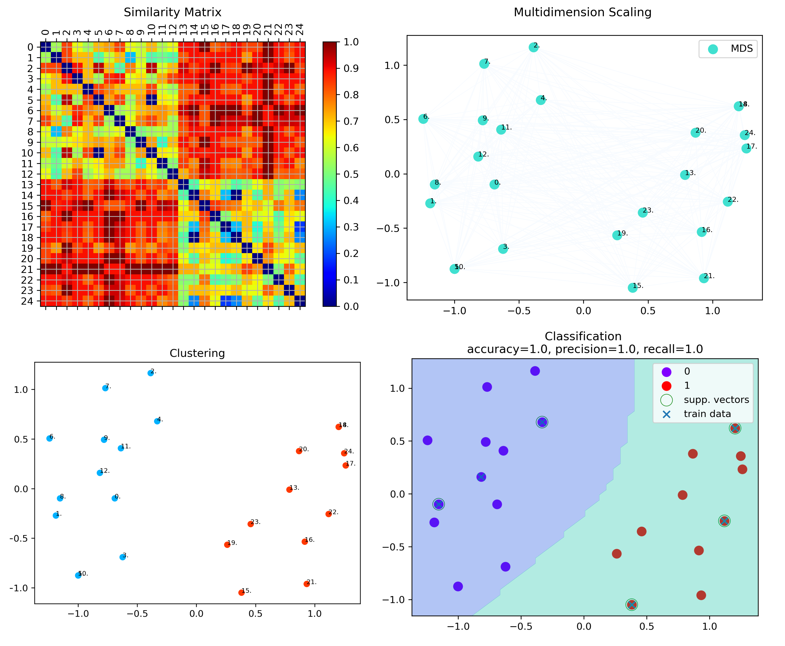

# QHAna - Quantum Humanities Analysis Tool
[](https://opensource.org/licenses/Apache-2.0)

The Quantum Humanities Analysis Tool is a toolset of Machine Learning techniques for classical and quantum hardware, designed for the use with the MUSE Repository [1].

## Example Output

The following figures are the output of a clustering and classification with a dataset consisting of 25 costumes done with QHAna.
<br/>
<br/>


## Features
A rich set of techniques, mostly for categorical data, are already implemented and can be use straight forward.
The features can be split up into 4 different categories:

### Data Preparation
In order to use several machine learning techniques such as clustering or classification, one needs to convert categorical data into a numerical representation.
Currently, the following data preparation schemes are supported or on the plan for future releases:

| Name                       | Comment                               |
| -------------------------- |---------------------------------------|
| One-Hot-Encoding           | Not yet available                     |
| Distance-Space-Computation | Using Wu-Palmer-Similarity metric [2] |

<br/>

### Feature Engineering
Once a numerical representation (mostly similarities or dissimilarities) has been found for the categorical data, the next step is to map those values to metrices in order to get real distances.
Moreover, as in most cases the data consist of multiple properties, i.e., living in a high dimensional computation space, it is necessary to apply a dimensionality reduction scheme.
In particular, the following approaches are implemented:

| Name                               | Comment                               |
| ---------------------------------- |---------------------------------------|
| Autoencoder                        | Not yet available                     |
| Embedding                          | Using Multidimensional Scaling [3, 4] |
| Principal Component Analysis (PCA) | Not yet available                     |

<br/>

### Clustering
Having real distances between data points allows the use of well known clustering algorithms.
We have implemented the following clustering algorithms:

| Name                    | Comment                                                              |
| ----------------------- |----------------------------------------------------------------------|
| OPTICS                  | Ordering points to identify the clustering structure [5, 6]          |
| QaoaMaxCut              | Quantum Approximate Optimization Algorithm for solving MaxCut [7, 8] |
| ClassicalNaiveMaxCut    | Own implementation with exponential running time                     |
| SdpMaxCut               | Semi-Definite Programming formulation of MaxCut [9, 10, 11, 12, 13]  |
| BmMaxCut                | Bureir-Monteiro solver for MaxCut [9, 10, 11, 12, 13]                |
| QNegrotKMeans           | Negative Rotation Quantum KMeans [14]                                |
| QInterferenceKMeans     | Destructive Interference Quantum KMeans [14]                         |
| QStatePreparationKMeans | Own implementation, extension to [14]                                |
| Classical KMeans        | SKlearn implementation [15, 16]                                      |
| PositiveCorrelationKMeans | Implementation of [24]                                             |
| Classical KMedoids      | SKlearn-Extra implementation [25, 26]

<br/>

### Classification
Once clusters have been created, we can perform some classification tasks.
The following clustering algorithms are implemented in QHAna:

| Name                    | Comment                                                               |
| ----------------------- |-----------------------------------------------------------------------|
| ClassicSklearnSVM       | Classical support vector machines using SKLearn [17, 18]              |
| qiskitQSVC              | Quantum Support Vector Classifier (based on quantum kernel) using Qiskit [19, 20] |
| qiskitVQC               | Variational Quantum Classifier using Qiskit [20, 21]                  |
| ClassicSklearnNN        | Classical neural network method using SKLearn [22]                    |
| HybridQNN               | Hybrid quantum-classical Neural Network using PyTorch and Qiskit [23] |

<br/>

## Installation
It is recommended to use the code within a virtual environment like [Anaconda Distribution](https://www.anaconda.com/distribution).
All necessary packages can be installed using the *qhana.yml* file located within this repository.
It is known to work within a linux, macOS, Windows and WSL environment.
To create the virtual environment, one can use the conda terminal and type in the following command:

`conda env create -f <path>`

with \<path\> being the path to the *qhana.yml* file.

The following packages (including their dependencies) are needed and will be installed when using the *qhana.yml* file:

| Name                   | Source                                               |
| ---------------------- | ---------------------------------------------------- |
| mysql-connector-python | https://anaconda.org/anaconda/mysql-connector-python |
| networkx               | https://anaconda.org/anaconda/networkx               |
| numpy                  | https://anaconda.org/anaconda/numpy                  |
| matplotlib             | https://anaconda.org/conda-forge/matplotlib          |
| simplejson             | https://anaconda.org/anaconda/simplejson             |
| colorama               | https://anaconda.org/anaconda/colorama               |
| scikit-learn           | https://anaconda.org/anaconda/scikit-learn           |
| scikit-learn-extra     | https://anaconda.org/conda-forge/scikit-learn-extra  |
| pandas                 | https://anaconda.org/anaconda/pandas                 |
| flask                  | https://anaconda.org/anaconda/flask                  |
| pygraphviz             | https://anaconda.org/anaconda/pygraphviz             |
| qiskit                 | https://qiskit.org                                   |
| qiskit-machine-learning| https://qiskit.org/documentation/machine-learning    |
| cvxpy                  | https://anaconda.org/conda-forge/cvxpy               |
| pylatexenc             | https://anaconda.org/conda-forge/pylatexenc          |

<br/>

## Access to the database
In order to get access to the database, one has to create a *config.ini* file such as:

```
[mysql]
host = <host address or IP>
user =  <username>
password =  <password>
database = <database name>
```

The file must lay in the top directory, i.e. the same directory as the *main.py* script.

<br/>

## Usage - Web GUI

All fetures are available in the Web GUI wich can be run using the following command:

```
python web.py
```

Thereby, a WSGI server will be started in the background and the home page of the application will be shown automatically.
This is the recommended approach to run the QHAna Tool.
The command Line interface do not cover all the features.

## Usage - Command Line

The program is devided into commands.
A program call has always the following structure:

```
main.py <global arguments> <command> <command arguments>
```

To create all the available taxonomies into a folder called "tax" one can run the following
```
main.py -ll 3 create_taxonomies -o tax
```

### Global Arguments

We have the following global arguments:

`-ll LOG_LEVEL, --log_level LOG_LEVEL` - log level for the current session: 0 - nothing, 1 - errors [default], 2 - warnings, 3 - debug

`-db DATABASE_CONFIG_FILE, --database_config_file DATABASE_CONFIG_FILE` - filepath for the *.ini file for the database connection

### Commands

At the moment, the following commands are availabel:

#### Create Taxonomies

`create_taxonomies` - creates the taxonomies from the database (svg, json and dot)

##### Arguments

` -o OUTPUT_DIRECTORY, --output_directory OUTPUT_DIRECTORY` - specifies the directory for the output [default: /taxonomies]

#### List implemented Taxonomies

`list_implemented_taxonomies` - lists all the implemented taxonomies that can be used for machine learning

#### List implemented Attributes

`list_implemented_attributes` - lists all the implemented attributes that can be used for machine learning

#### List implemented Attribute Comparer

`list_implemented_attribute_comparer` - lists all the implemented attribute comparer that can be used for machine learning

#### List implemented Aggregator

`list_implemented_aggregator` - lists all the implemented aggregator that can be used for machine learning

#### List implemented Element Comparer

`list_implemented_element_comparer` - lists all the implemented element comparer that can be used for machine learning

#### List implemented Transformer

`list_implemented_transformer` - lists all the implemented transformer that can be used for machine learning

## Disclaimer of Warranty
Unless required by applicable law or agreed to in writing, Licensor provides the Work (and each Contributor provides its Contributions) on an "AS IS" BASIS, WITHOUT WARRANTIES OR CONDITIONS OF ANY KIND, either express or implied, including, without limitation, any warranties or conditions of TITLE, NON-INFRINGEMENT, MERCHANTABILITY, or FITNESS FOR A PARTICULAR PURPOSE. You are solely responsible for determining the appropriateness of using or redistributing the Work and assume any risks associated with Your exercise of permissions under this License.

## Haftungsausschluss
Dies ist ein Forschungsprototyp. Die Haftung für entgangenen Gewinn, Produktionsausfall, Betriebsunterbrechung, entgangene Nutzungen, Verlust von Daten und Informationen, Finanzierungsaufwendungen sowie sonstige Vermögens- und Folgeschäden ist, außer in Fällen von grober Fahrlässigkeit, Vorsatz und Personenschäden, ausgeschlossen.

## Sources:

[1] Johanna Barzen, Michael Falkenthal and Frank Leymann, "Wenn Kostüme sprechen könnten: MUSE - Ein musterbasierter Ansatz an die vestimentäre Kommunikation im Film", Frank und Timme, 2018, https://www.iaas.uni-stuttgart.de/publications/INBOOK-2018-05-MUSE.pdf.

[2] Strehl, Tino: Identification of pattern indicators by vidual data mining methods for multivariate categorical data (in German: Identifikation von Musterindikatoren mit Methoden des visuellen Data Mining für multivariate kategoriale Daten), Master's Thesis, University of Applied Sciences Reutlingen, 2015.

[3] SKLearn documentation, Multidimensional scaling (MDS), https://scikit-learn.org/stable/modules/generated/sklearn.manifold.MDS.html.

[4] K. Backhaus, B. Erichson, W. Plinke and R. Weiber, "Multivariate Analysemethoden. Eine anwendungsorientierte Einführung", 11th Edition, 2006.

[5] SKlearn documentation, Ordering points to identify the clustering structure (OPTICS), https://scikit-learn.org/stable/modules/generated/sklearn.cluster.OPTICS.html.

[6] Ankerst, Mihael & Breunig, Markus & Kriegel, Hans-Peter & Sander, Joerg, "OPTICS: Ordering Points to Identify the Clustering Structure." Sigmod Record. Vol. 28. P. 49-60. Doi: 10.1145/304182.304187, 1999.

[7] Qiskit documentation, Max-Cut and Traveling Salesman Problem, https://qiskit.org/documentation/locale/de_DE/tutorials/optimization/6_examples_max_cut_and_tsp.html.

[8] Edward Farhi, Jeffrey Goldstone and Sam Gutmann, "A Quantum Approximate Optimization Algorithm", 2014, https://arxiv.org/pdf/1411.4028.pdf.

[9] Github Repository, pandrey-fr/maxcut, Max-Cut problem solving tools following a variety of approaches, https://github.com/pandrey-fr/maxcut.

[10] N. Boumal, V. Voroninski and A. Bandeira, "The non-convex Burer-Monteiro approach works on smooth semidefinite programs", In proceedings NIPS 2016, https://arxiv.org/pdf/1606.04970.pdf. 

[11] N. Boumal, "A Riemannian low-rank method for optimization oversemidefinite matrices with block-diagonal constraints", arXiv preprint, 2016, https://arxiv.org/pdf/1506.00575.pdf.

[12] N. Boumal, B. Mishra, P.-A. Absil and R. Sepulchre, "Manopt, a Matlab toolbox for optimization on manifolds", Journal of Machine Learning Research, 2014, https://jmlr.org/papers/volume15/boumal14a/boumal14a.pdf.

[13] P.-A. Absil, R. Mahony, and R. Sepulchre, "Optimization Algorithms on Matrix Manifolds", Princeton University Press, 2008, https://press.princeton.edu/absil.

[14] Sumsam Ullah Khan, Ahsan Javed Awan, Gemma Vall-Llosera, "K-Means Clustering on Noisy Intermediate Scale Quantum Computers", 2018, https://arxiv.org/pdf/1909.12183.pdf.

[15] SKLearn documentation, KMeans, https://scikit-learn.org/stable/modules/generated/sklearn.cluster.KMeans.

[16] David Arthur and Sergei Vassilvitskii, "k-means++: The Advantages of Careful Seeding", Proceedings of the eighteenth annual ACM-SIAM symposium on Discrete algorithms. Society for Industrial and Applied Mathematics Philadelphia, PA, USA. pp. 1027–1035, 2007, http://ilpubs.stanford.edu:8090/778/1/2006-13.pdf.

[17] SKLearn documentation, C Support Vector Machine (SVM), https://scikit-learn.org/stable/modules/generated/sklearn.svm.SVC.html.

[18] Chih-Chung Chang and Chih-Jen Lin, LIBSVM -- A Library for Support Vector Machines, https://www.csie.ntu.edu.tw/~cjlin/libsvm.

[19] Qiskit documentation, Quantum Support Vector Classifier, https://qiskit.org/documentation/machine-learning/stubs/qiskit_machine_learning.algorithms.QSVC.html#qiskit_machine_learning.algorithms.QSVC.

[20] Havlíček, V. et al., "Supervised learning with quantum-enhanced feature spaces." Nature, 567(7747), pp.209-212, 2019, https://arxiv.org/pdf/1804.11326.pdf.

[21] Qiskit documentation, Variational Quantum Classifier, https://qiskit.org/documentation/machine-learning/stubs/qiskit_machine_learning.algorithms.VQC.html#qiskit_machine_learning.algorithms.VQC.

[22] SKLearn documentation, Multi-layer Perceptron classifier, https://scikit-learn.org/stable/modules/generated/sklearn.neural_network.MLPClassifier.html.

[23] Qiskit notebook, Hybrid quantum-classical Neural Networks with PyTorch and Qiskit, https://qiskit.org/textbook/ch-machine-learning/machine-learning-qiskit-pytorch.html.

[24] Abhijat et al., "Quantum Unsupervised and Supervised Learning on Superconducting Processors", https://arxiv.org/abs/1909.04226

[25] SKLearn-Extra documentation, KMedoids, https://scikit-learn-extra.readthedocs.io/en/latest/generated/sklearn_extra.cluster.KMedoids.html.

[26] Park, H.S.and Jun, C.H., "A simple and fast algorithm for K-medoids clustering", Expert systems with applications, 36(2), pp.3336-3341. 2009. https://www.sciencedirect.com/science/article/abs/pii/S095741740800081X
